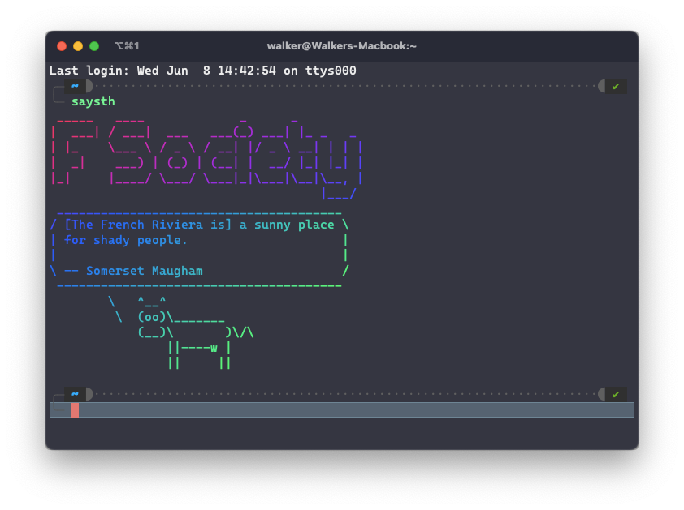
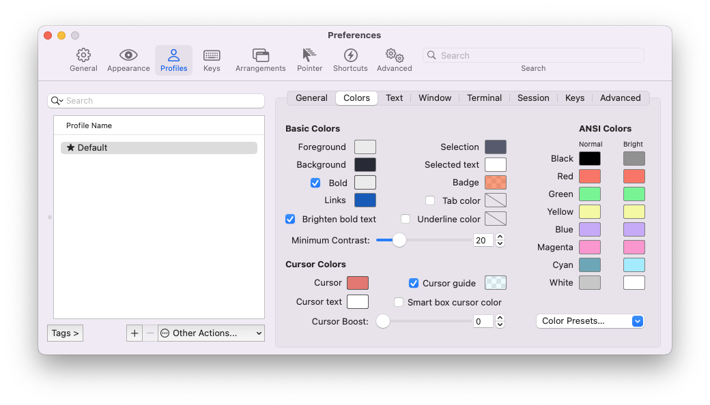

# shell configs

## 上网

[ubuntu-clash下载](https://github.com/Dreamacro/clash)

[macos-clashX Pro下载](https://install.appcenter.ms/users/clashx/apps/clashx-pro/distribution_groups/public)

### clash

选择对应版本下载解压得到二进制文件，`chmod +x` 添加可执行权限后扔进 `/usr/local/bin` 即可
配置文件扔进 `~/.config/clash/config.yaml`  
UI界面在浏览器打开 `clash.razord.top`

### 终端

在终端内使用代理都需要设置  
个人使用 `mixed-port: 7890`

```bash
export http_proxy=http://127.0.0.1:7890
export https_proxy=http://127.0.0.1:7890
export all_proxy=http://127.0.0.1:7890
```

详见 `.zshrc`

---

## zsh

```bash
brew install zsh
sudo apt-get install zsh
```

### 安装oh-my-zsh

```bash
sh -c "$(curl -fsSL https://raw.github.com/ohmyzsh/ohmyzsh/master/tools/install.sh)"
```

omz会自动更新自己和插件，也可以选择使用zplug管理插件（其实没有必要）

### 安装powerlevel10k主题

[powerlevel10k](https://github.com/romkatv/powerlevel10k)

首先安装 [nerd-fonts](https://github.com/ryanoasis/nerd-fonts/releases/tag/v2.1.0) ，选择一款自己喜欢的字体，并应用至你的终端  
大部分字体都提供了nerd版，增加了大量图标支持，特殊字体也可以自己合成

使用oh-my-zsh安装:

```bash
git clone --depth=1 https://github.com/romkatv/powerlevel10k.git ${ZSH_CUSTOM:-$HOME/.oh-my-zsh/custom}/themes/powerlevel10k
```

下载主题后在 `.zshrc` 中设置 `ZSH_THEME="powerlevel10k/powerlevel10k"`以启用



### .zshrc

下载 `zshrc` 后覆盖 `~/.zshrc` ，自己换里面路径

### 配色

选择 [Dracula](https://draculatheme.com) 主题，稍稍修改了光标等几个颜色



---

## vim

```bash
brew install neovim
sudo apt-get install neovim
```

将 `init.vim` 放至 `~/.config/nvim/` 下，插件按自己喜好去除不需要的

### vim-plug

[vim-plug](https://github.com/junegunn/vim-plug)安装

```bash
sh -c 'curl -fLo "${XDG_DATA_HOME:-$HOME/.local/share}"/nvim/site/autoload/plug.vim --create-dirs \
       https://raw.githubusercontent.com/junegunn/vim-plug/master/plug.vim'
```

插件安装

```vim
:PlugInstall
```

### coc.nvim

需要高版本 `nodejs` 支持，自行在[官网](https://nodejs.org/en/)安装

clangd需要llvm，ubuntu见[官网](https://apt.llvm.org)

```vim
:CocInstall coc-clangd
:CocInstall coc-python
```
